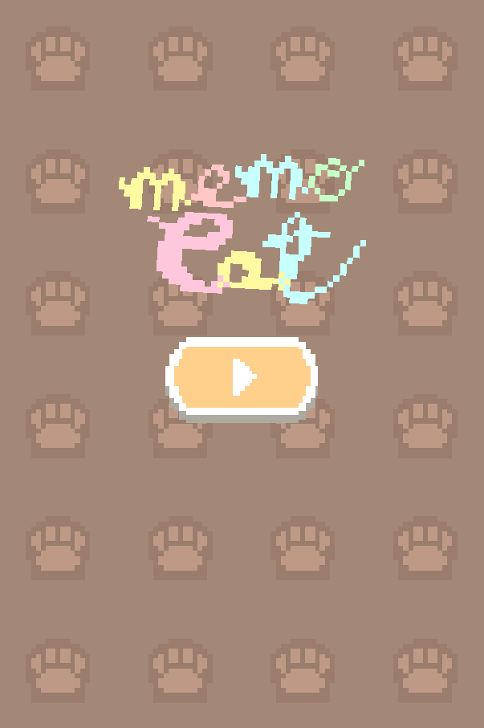
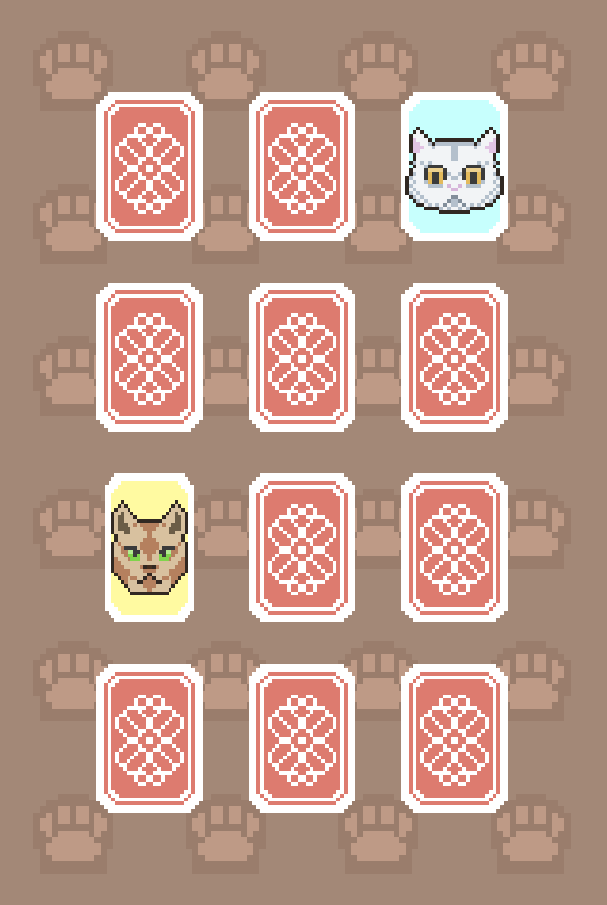

# Memo Cat 🐱
#### A Phaser memory minigame, with cats

* Simple minigame written with [Phaser 3.50](https://phaser.io/), Typescript and bundled with [Rollup](https://rollupjs.org).
* [Initial project template](https://github.com/photonstorm/phaser3-typescript-project-template) by Photonstorm ( :star: their project!).
* A very simple project written to start learning Phaser with Typescript, useful for newbies.

## Commands

* **Requires Node.js**. Install via `npm install` from root directory.
* Run via `npm run dev`.
* Run via `npm run watch` to watch for changes.

## Configuration
* Edit the rollup.config.dev.js file to change development settings.
* Edit the rollup.config.dist.js file to change production settings.

## Screenshots

